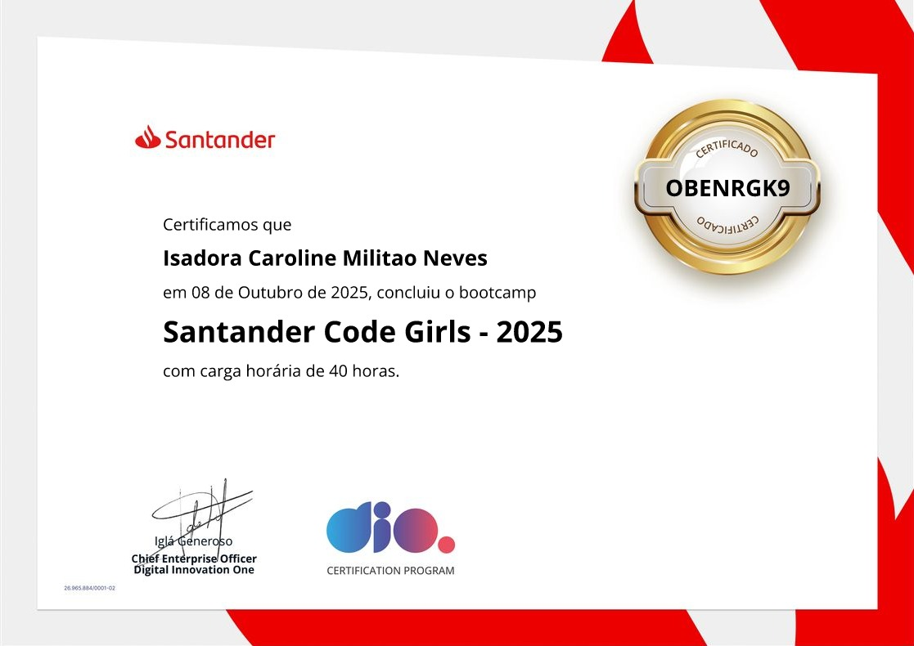

#  Conclusão do Bootcamp Code Girls - AWS

É com muita alegria que compartilho que finalizei o **Bootcamp Code Girls**!  

Durante este curso de **40 horas**, pude aprender e me certificar nas seguintes habilidades da AWS:

- **AWS**
- **Amazon EC2**
- **Amazon EBS**
- **Amazon S3**
- **AWS Lambda**
- **Amazon VPC**
- **Amazon Route 53**
- **Amazon Elastic Load Balancer**
- **Amazon RDS**
- **DynamoDB**
- **Amazon Glacier**
- **Amazon CloudFront**
- **AWS SNS**
- **AWS Step Functions**
- **AWS CloudWatch**
- **AWS CloudFormation**
- **AWS WAF**
- **AWS ECS**
- **Amazon EKS**
- **Amazon SQS**
- **AWS CloudTrail**

---

##  Conquistas do Bootcamp

Ao concluir o bootcamp, alcancei as seguintes conquistas:

- 41 cursos concluídos  
- 5 desafios de projeto finalizados  
- 2 desafios de código concluídos  
- Aumentei minha relevância na **Talent Match**  
- Conexão com experts do mercado tech  
- Networking com milhares de profissionais da área  

---

##  Agradecimentos

Gostaria de agradecer especialmente ao **professor Alexsandro Lechner**, que conduziu o bootcamp de forma incrível. Aprendi muito e a experiência foi extremamente enriquecedora!  

---

##  Próximos passos

Meu aprendizado não para por aqui! Pretendo continuar me aprofundando em AWS para conquistar a **certificação AWS Cloud Practitioner – Foundation (CLF-C02)** e atingir uma excelente nota.  

---

##  Certificado

Aqui está meu certificado de conclusão do Bootcamp Code Girls:

  
---

Estou animada para aplicar tudo o que aprendi em projetos reais e continuar evoluindo na minha carreira em tecnologia! 
