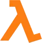
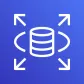

  

# Bootcamp Santander Code Girls 2025 - Minha Jornada em Computação em Nuvem

## Índice:
✨ Para começar, **navegue pelo Oráculo** clicando [AQUI](./Oracle/Oráculo.md)!

- [Sobre mim](#sobre-mim)
- [Objetivos do laboratorio](#objetivos-do-laboratório)
- [O que voce encontra aqui](#o-que-você-encontra-aqui)
- [Ferramentas e tecnologias](#ferramentas-e-tecnologias)
- [Contribuicao](#contribuição)
- [Fale comigo](#fale-comigo)
- [Licenca](#licença)

---
### Sobre mim
Oi! Eu sou **Isadora Militão Neves**, estudante de Ciência da Computação e Ciência de Dados, apaixonada por backend e dados.  
Estou documentando minhas práticas em nuvem, desafios e aprendizados para consolidar meus conhecimentos e facilitar consultas futuras.

---

### Objetivos do laboratório

1️⃣ Aplicar conceitos aprendidos sobre AWS  
2️⃣ Organizar e documentar todo o processo técnico  
3️⃣ Criar um repositório que sirva de guia para futuras implementações  
4️⃣ Preparar para a certificação AWS Cloud Practitioner  

---

###  O que você encontra aqui
- `/Oracle/oraculo.md` — O Oráculo é um guia de termos e conceitos do meu projeto, inspirado em MATRIX.
- `/modules/` — Cursos organizados por módulos  
- `/projects/` — Desafios de projetos que desenvolvi  
- `/certificates/` — Meus certificados de cada Módulo Concluído 
- `/assets/` — Armazena imagens e ícones usados no README e na documentação 

---

### Ferramentas e tecnologias

  <!-- Ferramentas gerais -->
  
  
  
  

  <!-- AWS Services com badges coloridos -->
  

---

 

## Contribuição
Este repositório é **aberto para a comunidade**!  
Se você é aluna do **Bootcamp Code Girls 2025** ou apenas quer se inspirar:

- **Dê uma estrela** no projeto se achou útil ou inspirador: [⭐ Star](https://github.com/isadora-cmn/AWS-CodeGirls-2025/stargazers)  
- **Faça um fork** para criar sua própria versão: [ Fork](https://github.com/isadora-cmn/AWS-CodeGirls-2025/fork)  
- **Deixe sugestões** abrindo uma issue ou pull request: [ Issue](https://github.com/isadora-cmn/AWS-CodeGirls-2025/issues) | [🔧 Pull Request](https://github.com/isadora-cmn/AWS-CodeGirls-2025/pulls)  

> 💡 Vamos juntas aprender, compartilhar e crescer na tecnologia! 

---

## Fale comigo
- LinkedIn: [Isadora Militão](https://www.linkedin.com/in/isadora-milit%C3%A3o-neves-61b85a346/)  
- GitHub: [isadora-cmn](https://github.com/isadora-cmn)  

---

## Licença
Este projeto está sob a **licença MIT** – veja o arquivo [LICENSE](LICENSE) para mais detalhes.  

