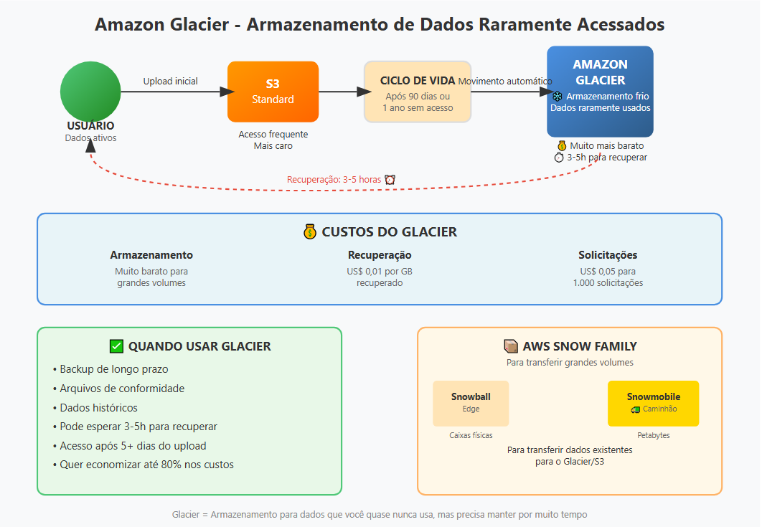

# Amazon Glacier

Amazon Glacier é um dos tipos de armazenamento do [[S3 (Simple Storage Service)]]

Ele oferece armazenaento durável para qualquer tipo de formato de dados que será acessado depois de 5 dias .

Amazon Glacier é um serviço da AWS usado para guardar **dados que você quase nunca usa**, colocando-os em um tipo de **armazenamento mais barato**.  
Ele funciona junto com o gerenciamento do ciclo de vida dos dados: depois de um tempo sem uso (por exemplo, 90 dias ou 1 ano), os dados são movidos para o Glacier para **economizar dinheiro**.

Use o Amazon Glacier quando:

- Você **não precisa dos dados imediatamente**, podendo esperar **3 a 5 horas** para recuperá-los.
    
- O custo é **US$ 0,01 por GB** recuperado e **US$ 0,05 para cada 1.000 solicitações**.
AWS Snow é usado para **transferir grandes volumes de dados (até petabytes)** para a nuvem.

- **Snowball / Snowball Edge** → caixas físicas para envio de dados.
    
- **Snowmobile** → caminhão para transferir enormes quantidades de dados.

[Voltar para o Oráculo](../../Oracle/Oráculo.md)

  

