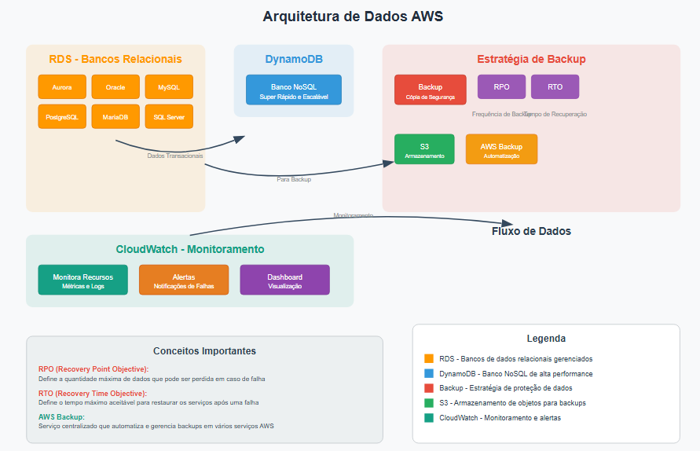

# Arquitetura de Dados AWS:

Este diagrama representa uma **arquitetura completa de dados na nuvem AWS**, integrando armazenamento, backup e monitoramento para aplicações empresariais.

## Componentes

### 🗄️ Armazenamento
- **RDS**: Bancos relacionais gerenciados (Aurora, MySQL, PostgreSQL, Oracle, MariaDB, SQL Server)
- **DynamoDB**: Banco NoSQL de alta performance e escalabilidade automática

###  Backup & Recuperação
- **RPO/RTO**: Definem frequência de backup e tempo máximo de recuperação
- **S3**: Armazenamento durável para backups
- **AWS Backup**: Automatiza políticas de backup centralizadas

###  Monitoramento
- **CloudWatch**: Métricas, alertas e dashboards em tempo real

## Fluxo
1. Dados processados no RDS/DynamoDB
2. Backup automatizado para S3 via AWS Backup
3. CloudWatch monitora e alerta sobre falhas
4. Dashboards fornecem visibilidade operacional

## Benefícios
- Alta disponibilidade e escalabilidade
- Proteção de dados com RPO/RTO definidos
- Monitoramento proativo
- Automação completa de backups
- Compliance empresarial

