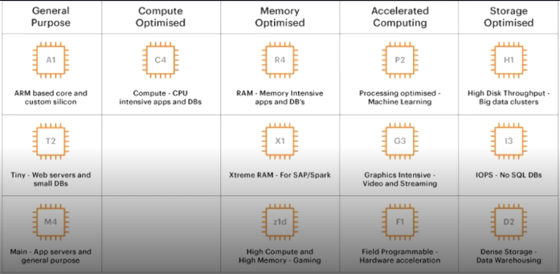
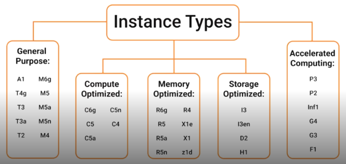

# Amazon EC2 -> Elastic Compute Cloud:

**EC2** → computador virtual para rodar aplicações.

---

### **O que é:**  
É como se fosse um **computador virtual na nuvem**. Você não precisa comprar um computador físico; você cria um "PC online" e usa para rodar seus programas, sites, APIs ou qualquer aplicação.

---

### **Para que serve:**  
Sempre que você precisa de **processamento**, como rodar um site, processar dados, criar uma API, ou treinar um modelo de dados, você usa uma instância EC2.

---

### **Como funciona:**

- Você escolhe o **tamanho do computador virtual** (quantos núcleos de processador, quanta memória RAM, etc).  
- Pode ligar e desligar quando quiser.  
- Você **paga só pelo tempo que usa** (como alugar o computador).

---

##  **Analogia:**  
É como alugar um computador poderoso na internet para trabalhar, sem precisar comprar fisicamente.

---

**No modelo Cloud, uma EC2 é do tipo IaaS**, ou seja, quando criamos um EC2 estamos utilizando o tipo **Infraestrutura como Serviço**.

**Nossa responsabilidade sobre este recurso:** aplicativos, dados e conexões que fazemos.

---

---

### **Os tipos de instâncias EC2**  
Cada tipo de instância oferece diferentes recursos de computação como memória e armazenamento e é agrupado em **famílias de instâncias** com base nesses recursos.

 

 

[Voltar para o Oráculo](../../Oracle/Oráculo.md)

  

