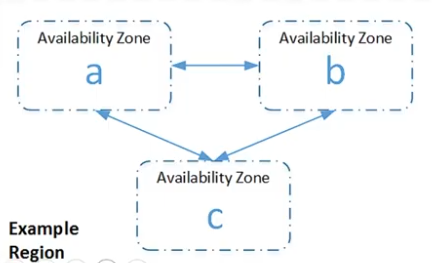

# Region e Availability Zones

Cada região (**region**) é projetada para ser isolada das outras regiões.  
Isso proporciona a maior tolerância a falhas e estabilidade possível.

Uma região é composta por 2 ou mais zonas de disponibilidade.

---

---

A AWS possui uma extensa rede global de data centers, chamados de **"Regions"** e **"Availability Zones"**.

- **Regions**: São áreas geográficas contendo várias Availability Zones.  
- **Availability Zones**: São data centers independentes fisicamente, mas conectados logicamente, para garantir alta disponibilidade.
