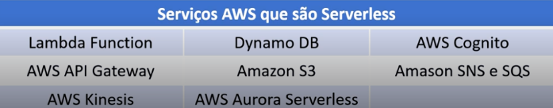

# Serverless:

**O que é:**  
Serverless (ou “sem servidor”) não significa que **não existem servidores**, mas que você **não precisa se preocupar em gerenciar o servidor**. A empresa de nuvem (como a AWS) cuida de toda a infraestrutura para você.

---

### **Para que serve:**  
Quando você quer rodar código ou aplicações **sem precisar se preocupar em configurar ou manter um computador na nuvem**.

---

### **Como funciona:**

- Você escreve **funções ou pequenos programas**.
- Essas funções **só rodam quando são chamadas** (por exemplo, quando alguém clica num botão no seu site).
- Você **paga só pelo que usar**, ou seja, só enquanto o código estiver rodando, diferente de um servidor que fica ligado o tempo todo.

---

##  **Analogia:**  
É como um **garçom que aparece só quando você chama**: você não precisa manter o garçom esperando o tempo todo, ele só vem quando precisa.

---

Não gerenciamos os servidores destes recursos.  
São recursos gerenciados pela AWS.
 

[Voltar para o Oráculo](../../Oracle/Oráculo.md)