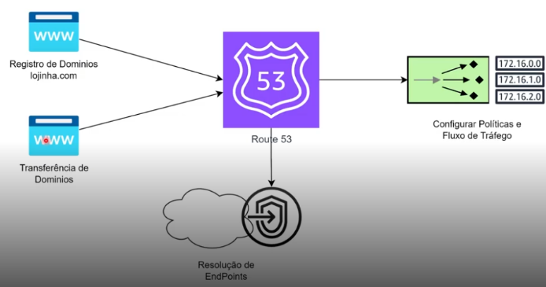

# Amazon Route 53:

O Amazon Route 53 é um serviço que faz a **conversão do DNS (Domain Name Service) para endereços IP**.  

Além disso, possui características importantes para trabalhar com o fluxo de rede, como:  
- Resolução de nomes DNS para o nosso **IP interno** na AWS.  
- Resolução e gerenciamento de **tráfego de rede**.

---

### **CONVERSÃO:**

