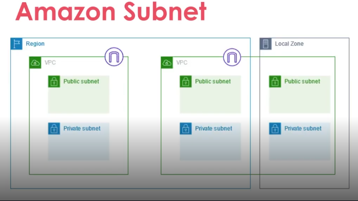

### **O que é Amazon Subnet?**

Uma subnet é uma gama de endereços IP na VPC e uma **sub-rede** lógica criada dentro de uma rede virtual do AWS, conhecida como **VPC (Virtual Private Cloud)**.

É possível criar recursos da AWS, como instâncias do EC2, em sub-redes específicas.

Cada sub-rede deve residir inteiramente dentro de uma **zona de disponibilidade**.

 

[Voltar para o Oráculo](../../Oracle/Oráculo.md)

  

