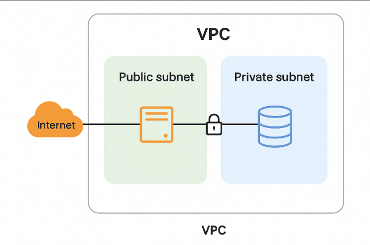

# Rede VPC:

**VPC** → É o retângulo grande que engloba tudo. Ele representa sua rede privada dentro da AWS.

**Public Subnet (à esquerda)** → É uma sub-rede pública, ou seja, os recursos aqui podem se comunicar com a internet.  
No diagrama, há um servidor conectado à Internet — seria, por exemplo, uma instância EC2 que hospeda seu site.

**Private Subnet (à direita)** → É uma sub-rede privada, sem acesso direto à internet.  
Aqui está um banco de dados, protegido atrás de um cadeado — só o servidor na subnet pública pode se conectar a ele.

**Cadeado no meio** → Representa as regras de segurança (**Security Groups / NACLs**) que controlam quem pode acessar os recursos da subnet privada.

---

Você cria uma rede na nuvem, coloca o que precisa ser público (servidores web) em uma subnet pública e o que precisa ser protegido (banco de dados, APIs internas) em uma subnet privada.  
Depois, usa regras de segurança para permitir apenas o tráfego que você quer.
 

[Voltar para o Oráculo](../../Oracle/Oráculo.md)

  

