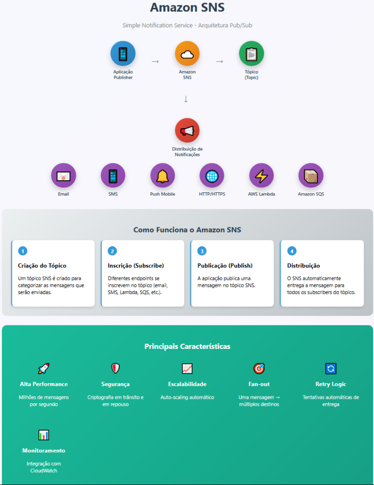

# Amazon SNS - (Simple Notification Service)

Serviço de mensagens assíncronas, disponível e seguro para notificações de mensagens entre aplicativos distribuídos e microsserviços.
Ele permite o envio de notificações push para dispositivos móveis, mensagens de texto, e-mails ou integrações com outros serviços da AWS, como o Amazon SQS ou o AWS Lambda.

[Voltar para o Oráculo](../../Oracle/Oráculo.md)

  

