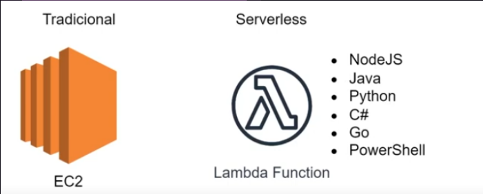

# AWS Lambda

O AWS Lambda é um serviço de computação serverless da Amazon que permite executar código automaticamente em resposta a eventos, 
sem necessidade de gerenciar servidores. 
Ele facilita e acelera o desenvolvimento de aplicações modernas ao cuidar automaticamente da infraestrutura de computação necessária.

[Voltar para o Oráculo](../../Oracle/Oráculo.md)

  

